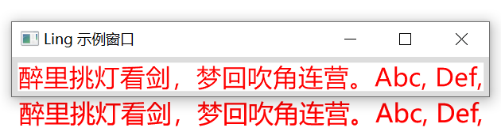

# Ling
A GUI Framework for modern C++20

# Features

- 支持UTF-8文本
- 支持多种布局方式
- 文字抗锯齿
- 兼容性好
- 内存消耗极低

# Layout

- 垂直水平居中

```c++
    auto ele = new Element();
    ele->setSize(100, 100);
    ele->setBackgroundColor(0xFF876543);
    ele->setCaption(true);
    win->setAlignItems(Align::Center);
    win->setJustifyContent(Justify::Center);
    win->addChild(ele);
```


- 上中下布局
```c++
auto top = new Element();
top->setSize(SizeNaN, 80);
top->setBackgroundColor(0xFF876543);
top->setCaption(true);
win->addChild(top);

auto center = new Element();
center->setFlexGrow(1.f);
center->setFlexShrink(1.f);
center->setBackgroundColor(0xFF9988aa);
win->addChild(center);

auto bottom = new Element();
bottom->setSize(SizeNaN, 40);
bottom->setBackgroundColor(0xFF313951);
win->addChild(bottom);

win->setFlexDirection(FlexDirection::Column);
```


- 左右布局
```c++
auto left = new Element();
left->setSize(300, SizeNaN);
left->setBackgroundColor(0xFF876543);
left->setCaption(true);
win->addChild(left);

auto right = new Element();
right->setFlexGrow(1.f);
right->setFlexShrink(1.f);
right->setBackgroundColor(0xFF9988aa);
win->addChild(right);

win->setFlexDirection(FlexDirection::Row);
```


# Event

```c++
auto ele = new Element();
ele->setSize(120, 40);
ele->setBackgroundColor(0xFFFFFFFF);
ele->onMouseEnter([ele](const MouseEvent& event) {
    ele->setBackgroundColor(0xFF000000);
    ele->update();
    });
ele->onMouseLeave([ele](const MouseEvent& event) {
    ele->setBackgroundColor(0xFFFFFFFF);
    ele->update();
    });
ele->onMouseDown([ele](const MouseEvent& event) {
    ele->setBackgroundColor(0xFF00FFFF);
    ele->update();
    });
ele->onMouseUp([ele](const MouseEvent& event) {
    ele->setBackgroundColor(0xFFFFFF00);
    ele->update();
    });
win->setAlignItems(Align::Center);
win->setJustifyContent(Justify::Center);
win->addChild(ele);
```

## Text

```c++
auto ele = new Label();
ele->setText(u8R"(醉里挑灯看剑，梦回吹角连营。Abc, Def,)");
ele->setFont("Microsoft YaHei");//STSong
ele->setFontSize(21);
ele->setBackgroundColor(0xFFFFFFFF);

win->setAlignItems(Align::Center);
win->setJustifyContent(Justify::Center);
win->addChild(ele);
```

文本清晰度对比（与Word）：




