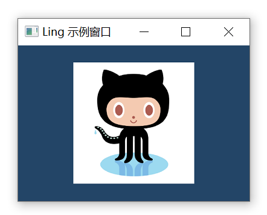

# Ling

A GUI Framework for modern C++

# 目标

- 编译产物体积尽可能小；
- 内存占用尽可能少；
- 性能尽可能好；
- 使用尽可能简单；
- 功能尽可能多；

# 编译产物大小


上图中 Ling.lib 是我这个框架的静态链接库。

Demo.exe 是我使用这个静态链接库开发的示例程序。

这个可执行程序不依赖任何dll，大小只有591KB。

# Element

- 元素
```c++
std::unique_ptr<WindowBase> win;
win = std::make_unique<WindowNormal>();
win->setTitle(L"Ling 示例窗口");
win->setWindowSize(1000, 800);
win->setWindowToScreenCenter();
win->setBackgroundColor(0x234567FF);
win->createNativeWindow();

win->setFlexDirection(FlexDirection::Row);
win->setFlexWrap(Wrap::Wrap);

auto rect = new Element();
rect->setSize(100, 100);
rect->setBackgroundColor(0x876543FF);
rect->setMargin(30);
win->addChild(rect);

auto roundRect = new Element();
roundRect->setSize(100, 100);
roundRect->setBackgroundColor(0x876543FF);
roundRect->setMargin(30);
roundRect->setRadius(12);
win->addChild(roundRect);

auto circle = new Element();
circle->setSize(100, 100);
circle->setBackgroundColor(0x876543FF);
circle->setMargin(30);
circle->setRadius(50);
win->addChild(circle);

auto rect1 = new Element();
rect1->setSize(100, 100);
auto gradient = std::make_shared<Gradient>(GradientType::Linear);
gradient->addColor(0.f, 0xFF0066FF);
gradient->addColor(1.f, 0x0066FFFF);
rect1->setBackgroundColor(gradient);
rect1->setMargin(30);
win->addChild(rect1);

win->layout();
win->show();
```


# Layout

- 垂直水平居中

```c++
    auto ele = new Element();
    ele->setSize(100, 100);
    ele->setBackgroundColor(0xFF876543);
    ele->setCaption(true);
    win->setAlignItems(Align::Center);
    win->setJustifyContent(Justify::Center);
    win->addChild(ele);
```


- 上中下布局
```c++
auto top = new Element();
top->setSize(SizeNaN, 80);
top->setBackgroundColor(0xFF876543);
top->setCaption(true);
win->addChild(top);

auto center = new Element();
center->setFlexGrow(1.f);
center->setFlexShrink(1.f);
center->setBackgroundColor(0xFF9988aa);
win->addChild(center);

auto bottom = new Element();
bottom->setSize(SizeNaN, 40);
bottom->setBackgroundColor(0xFF313951);
win->addChild(bottom);

win->setFlexDirection(FlexDirection::Column);
```


- 左右布局
```c++
auto left = new Element();
left->setSize(300, SizeNaN);
left->setBackgroundColor(0xFF876543);
left->setCaption(true);
win->addChild(left);

auto right = new Element();
right->setFlexGrow(1.f);
right->setFlexShrink(1.f);
right->setBackgroundColor(0xFF9988aa);
win->addChild(right);

win->setFlexDirection(FlexDirection::Row);
```


# Event

```c++
App::loadSystemFont("SimHei");
auto label = std::make_shared<Ling::Label>();
label->setFontSize(14);
static int countNum{ 0 };
auto str =std::format(L"点击我：{}次", countNum);
label->setText(str);
label->setFontName("SimHei");
label->setForegroundColor(0X000000FF);
label->setBackgroundColor(0xFFFFFFFF);
label->onMouseEnter([label](const MouseEvent& event) {
    label->setBackgroundColor(0xDD0066FF);
    label->update();
    });
label->onMouseLeave([label](const MouseEvent& event) {
    label->setBackgroundColor(0xFFFFFFFF);
    label->update();
    });
label->onMouseDown([label](const MouseEvent& event) {
    label->setBackgroundColor(0xFF00FFFF);
    auto str = std::format(L"点击我：{}次", ++countNum);
    label->setText(str);
    label->update();
});
```


## Text

```c++
auto ele = new Label();
ele->setText(u8R"(醉里挑灯看剑，梦回吹角连营。Abc, Def,)");
ele->setFont("Microsoft YaHei");//STSong
ele->setFontSize(21);
ele->setBackgroundColor(0xFFFFFFFF);

win->setAlignItems(Align::Center);
win->setJustifyContent(Justify::Center);
win->addChild(ele);
```

文本清晰度对比（与Word）：


```c++
App::loadFontFile("iconfont.ttf");

win->setFlexDirection(FlexDirection::Row);
win->setFlexWrap(Wrap::Wrap);
const std::u8string arr[] = { 
    u8"\ue687", u8"\ue688", u8"\ue686", u8"\ue689", u8"\ue68a", 
    u8"\ue68b", u8"\ue68c", u8"\ue68d", u8"\ue68e", u8"\ue68f", 
    u8"\ue690", u8"\ue691", u8"\ue692", u8"\ue693",
};

for (auto& iconCode:arr)
{
    auto ele = new Label();
    ele->setText(iconCode);
    ele->setFontName("iconfont");
    ele->setFontSize(63);
    ele->setForegroundColor(0x000000FF);
    ele->setPadding(20.f);
    win->addChild(ele);
}
```


# 图像

```c++
auto ele = std::make_shared<Image>();
ele->setSize(200, 200);
ele->setSrc(L"img.png"); 
win->setAlignItems(Align::Center);
win->setJustifyContent(Justify::Center);
win->addChild(ele);
```
- png jpeg jpg webp



- svg


# Warning

This library is a work in progress! Anything can change at any moment without any notice! Use this library at your own risk!

# Thanks

- [Thorvg](https://github.com/thorvg/thorvg) (MIT License)
- [Yoga](https://github.com/facebook/yoga) (MIT License)